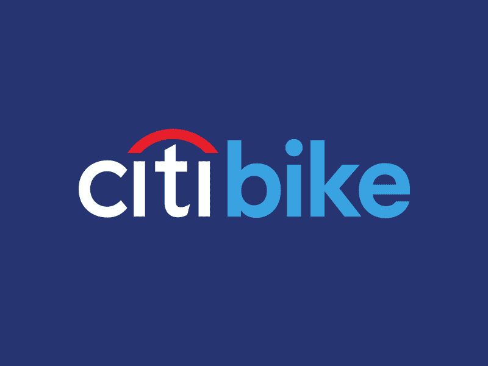
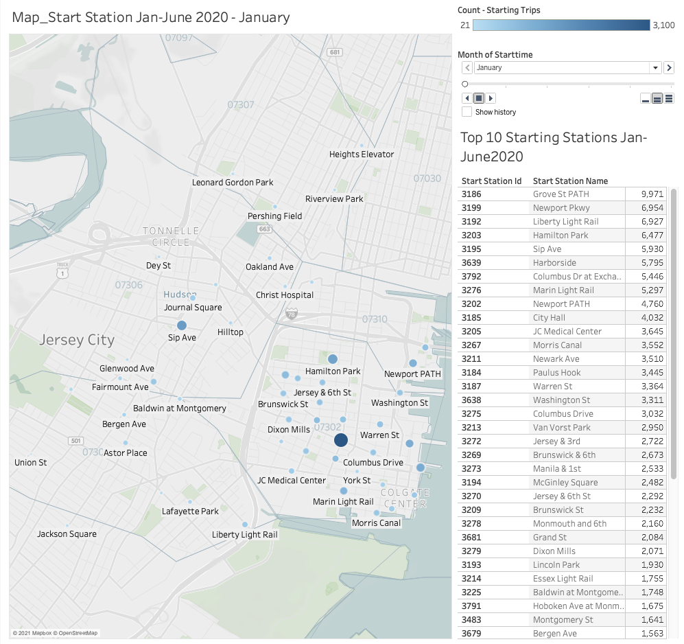
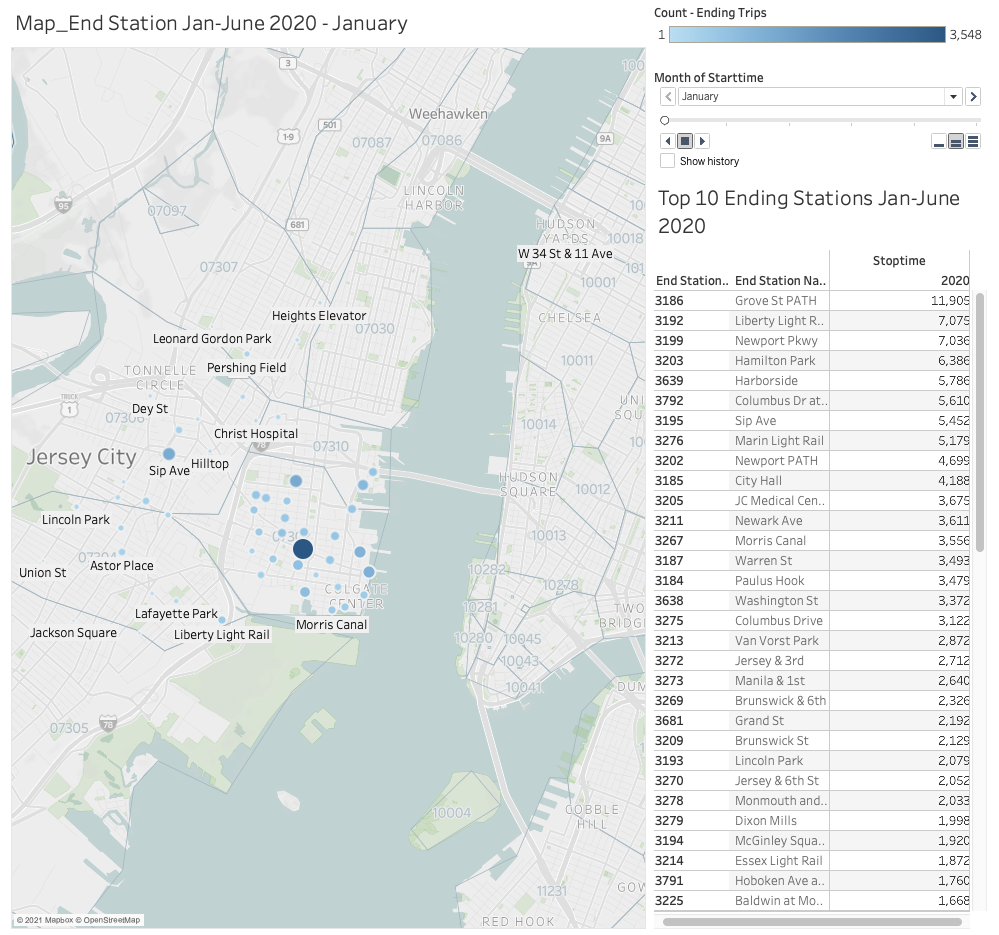

# Tableau-Challenge

## Citi Bike Analytics

## Background

- - -

I was recently hired on by New York Citi Bike Program, the largest bike sharing program in the United States, as the new lead analyst to assist in generating regular reports for city officials. Since 2013, the Citi Bike Program has implemented a robust infrastructure for collecting data of the program's utilization infrastructure. Because city officials are looking to publicize and improve the city program, the following "CITY BIKE ANALYTICS CASE REPORT" was created to share Citi Bike's program utilization via monthly collected data from January 2020 to June 2020. 

##### Note: This Report was written/edited with Tableau Public, Python, Pandas, and Microsoft Excel. 

https://public.tableau.com/views/Tableau_challenge_citibike_TopStartingStationsMonth2020/Story1?:language=en&:display_count=y&:origin=viz_share_link

### Task 1: Unexpected Phenomena

* Top 10 Starting Stations: Grove St PATH, Newport Pkwy, Liberty Light Rail, Hamilton Park, Sip Ave, Harborside, Columbus Dr at Exchange Pl, Marin Light Rail, Newport PATH, and City Hall. 

* Top 10 Ending Stations: Grove St PATH, Liberty Light Rail, Newport Pkwy, Hamilton Park, Harborside, Columbus Dr at Exchange Pl, Sip Ave, Marin Light Rail, Newport PATH, and City Hall. 

* Higher Male User % than Female.

* Alarming # of Gender Misinformation from Non-Subscribers.

* More Citi Bike Utilization during Morning (7-9AM) & Afternoon (4-7PM) Rush Hour.

* More Millennial Citi Bike users than ANY other Generation. 

* Bike Maintenance is HEAVIER for "Bike Trip Count" bike units than "Bike Trip Duration" bike units. 

### Task 2: Tableau Dashboards

* Introduction : Citi Bike Analytics
* Citi Bike Map Start Station : January - June 2020 / Monthly Visual.
* Citi Bike Map End Station : January - June 2020 / Monthly Visual.
* Citi Bike Map Start & End Station Table Summary: January - June 2020.
* Citi Bike Monthly Trip & Gender User Count Comparison.
* Citi Bike Gender Count & User Type Comparison: January - June 2020. 
* Citi Bike User Type Comparison (Subscriber vs. Customer): January - June 2020.
* Citi Bike User Type Utilization By Month Date: January - June 2020.
* Citi Bike Utilization Unit Count by 24 Hour Time Period: January - June 2020.
* Citi Bike Age Demographics: January - June 2020. 
* Citi Bike Maintenance Scatter Plot Recommendations: January - June 2020.
* Citi Bike Maintenance Bar Graph Recommendations: January - June 2020.
* End of Report

### Task 3: Visualizations - Dynamic Map

### Task 4: Phenomenons Analysis

* It would be highly recommended for the Citi Bike Program to install more resources and customer service represenatives near these locations. I believe it will greatly help to retain our current subscribers and incourage new customers by having Citi Bike personnel in these "high traffic" stations.  Also, our Citi bikes must be in top shape in these locations. The last thing we want is for our WORST maintenace bikes to be at our BEST starting and ending location stations. 

* It appears that there is a significantly higher population of Male Citi Bike users than Female users.  Nearly 3x the rate from January to March 2020 & 2x the user rate from May to June 2020. Also, please notice a % increase in the "unknown" gender users who do not trutfully input their gender.

* An increasing % of customers are not truthfully inputting their gender. This could be due to gender classification (no longer labeling sexuality as male/female), customer fear of sharing personal information with Citi Bike, unease of surveillance, dismay of location awareness (user tracking), technologically illiterate, etc. We need to find out why they are doing this!!!

* Although there has been an increase of female ridership from the Citi Bike gender outreach, there is still a significant gap between female/male subscribers and customer/subscriber usertype in general. What additional outreach programs can we create to get more subscribers? What additonal outreach programs can we instill to promote female ridership?

* On average there seems to be a higher rate of Citi Bike users during the middle of the month than towards the end of the month. A similar correlation is seen between Customers and user Subscribers. I would recommend having a promotional outreach program on the first day of each month. Maybe  something like a "Freeride Monday"? We could use the monthly promotion to increase our overall usage rate / user.

* There seems to be a high percentage of Citi Bike users born from 1980 to 1995 for both Male and Female users. This age demographic is significant toward our future marketing campaigns. The Millennial generation is are currently our highest users and Generation X users come in second. This could be due to Millennials wanting to be more environmentally cautious than other age demographics. We should also look at market strategies to attract future Generation Z users.

* Maintenance Recommendation: 
The following Citi Bikes should be should be maintenanced and/or replaced due to tripduration distance and utilization trip count. 

* Bikeid: 42197 - Highest Tripduration;
42535 - 2nd Highest;
38355 - 3rd Highest;
42532 - 4th Highest;
42228 - 5th Highest;

* Bikeid: 42296 - Highest Trip Count;
42545 - 2nd Highest;
42134 - 3rd Highest;
42298 - 4th Highest;
42258 - 5th Highest;

### Dataset

* [Citi Bike Data](https://www.citibikenyc.com/system-data) webpage.

* 202001-citibike-tripdata.csv.zip
* 202002-citibike-tripdata.csv.zip
* 202003-citibike-tripdata.csv.zip
* 202004-citibike-tripdata.csv.zip
* 202005-citibike-tripdata.csv.zip
* 202006-citibike-tripdata.csv.zip

End of README.md
